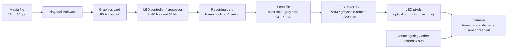
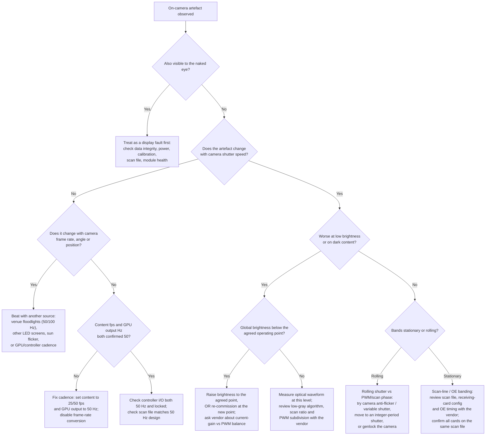

# PWM Operation and On-Camera Performance of LED Perimeter Displays

**Technical reference for sales, engineering, commissioning, broadcast and photography**

Document type: Engineering white paper and commissioning reference
Scope: PWM-driven LED perimeter displays in a 50 Hz production environment
Status of hardware detail: Vendor-neutral. Hardware-specific timing is labelled *implementation-dependent*.
Revision: 1.0

---

## 1. Title and reading guide

**Full title:** How PWM operation, system frame timing and camera exposure interact to determine the on-camera appearance of a PWM-driven LED perimeter display, and the operating conditions expected for a system commissioned as a 50 Hz installation.

**How to read this document**

| If you are a… | Read at least |
|---|---|
| Salesperson / account manager | Sections 2, 5, 14, 17, and the one-page field guide (Section 20) |
| Customer / venue technical manager | Sections 2, 3, 5, 6, 13, 17, 20 |
| Photographer / broadcast camera operator | Sections 2, 11, 12, 13, 20 |
| Installation / commissioning technician | Sections 3–6, 10–12, 15, 16, 18, 20 |
| Display / video systems engineer | All sections, plus Section 18 |

Every section after the executive summary is more technical than the one before it. You can stop when you have what you need.

---

## 2. Executive summary

An LED perimeter display is driven by **pulse-width modulation (PWM)**: each LED is switched on and off very rapidly, and brightness is set by how much of each cycle the LED is on. To the human eye this looks like steady, continuous light because human vision blends rapid flicker together. A camera does not blend light the same way. A camera opens its shutter for a short, precisely timed window and records only the light that arrives during that window.

Because of this difference, a display that looks perfectly uniform to a person in the stadium can, in a photograph or a broadcast picture, show:

- horizontal or diagonal **bands** that scroll or sit still,
- **brightness differences** between parts of the image,
- **colour shifts** between areas that should match,
- **partially lit** or **partially dark** regions,
- **flicker** or pulsing between successive video frames.

These effects are not usually caused by a faulty LED module. They are caused by the **timing relationship** between several independent clocks in the system:

1. the **frame rate** of the video content (frames per second, fps),
2. the **output refresh rate** of the graphics card (Hz),
3. the **input and output frame rate** of the LED controller/processor,
4. the **frame timing** of the receiving cards, set by the **scan file**,
5. the **row-scanning frequency** produced by multiplexed scanning,
6. the **PWM / grayscale refresh rate** of the LED driver IC (for example 3200 Hz),
7. the **frame rate** of the camera,
8. the **shutter / exposure time** of the camera.

A **50 Hz video signal** and a **3200 Hz PWM refresh** are **different layers of the same system**. The 50 Hz layer is how often a new picture is delivered. The 3200 Hz layer is how often each LED repeats its brightness pulse pattern within that picture. They are related (in our example implementation, 3200 ÷ 50 = 64 PWM repetitions per video frame) but they are **not the same measurement**, and one cannot be substituted for the other.

**What we deliver.** When we design, configure, test and hand over a perimeter system as a **50 Hz system**, we expect the customer's **complete signal chain to stay at 50 Hz**: media at 25 or 50 fps, graphics card at 50 Hz, controller in and out at 50 Hz, receiving cards and scan file validated at 50 Hz, and the resulting driver-IC PWM/grayscale refresh at the specified value (3200 Hz in our example). The camera settings used on site must be chosen and tested against **that** configuration. If any link in the chain is later changed — the content frame rate, the graphics-card output, the controller timing, the scan file, the brightness operating point, or the camera exposure — the on-camera behaviour can change and must be re-validated.

**What a spec sheet cannot promise.** A high advertised refresh rate (3200 Hz, 3840 Hz, or higher) **reduces the likelihood** of visible camera artefacts but **does not guarantee** a clean picture at every brightness, every content level and every shutter speed. This document explains why, and how to verify performance for a specific installation.

---

## 3. The complete timing chain

### 3.1 The signal path

```
Media file → playback software → graphics card → LED controller / processor
           → receiving card → scan-file timing → LED driver IC → LED pixels → camera
```



### 3.2 What happens at each stage

**1. Media file.**
A video file contains a fixed number of **unique images per second** — its content frame rate, in fps. A 25 fps file has 25 distinct pictures per second; a 50 fps file has 50. The file also carries an encoding (colour space, gamma/transfer function, bit depth). Nothing about the file changes how fast the LEDs pulse; it only defines how often the picture *content* is allowed to change.

**2. Playback software.**
The player decodes the file and presents finished frames to the operating system's graphics stack. It may **repeat** frames (to take 25 fps up to a 50 Hz output), **drop or blend** frames (if content and output do not divide evenly), or apply its own colour conversion. Frame repetition done cleanly is invisible; frame dropping or blending done to fix a mismatch is a common source of judder and cadence artefacts.

**3. Graphics card (GPU).**
The GPU sends a **continuous stream of full frames** down the cable at a fixed **output refresh rate** in Hz, locked to a pixel clock. At 50 Hz it emits exactly 50 frames per second whether or not the content changed. This is the first hard, clock-driven rate in the chain. If the GPU is set to 60 Hz while content is 50 fps, the GPU must show some frames for 1 refresh and others for 2 — a 5:6 cadence that a camera can reveal as periodic motion stutter or brightness beat.

**4. LED controller / processor (sender).**
The controller receives the GPU stream (**input frame rate**) and drives the receiving cards over a data link (**output frame rate**). Many controllers can convert between the two — for example accept 60 Hz and output 50 Hz, or run "frame multiplication". **In a system we deliver as 50 Hz, the controller input and output are both 50 Hz and no conversion is used.** The controller also applies global brightness, colour processing and (often) part of the low-grayscale strategy.

**5. Receiving card.**
The receiving card latches each incoming frame and generates the actual drive signals for the panel: clock, latch, output-enable (OE) and serial grayscale data to the driver ICs. It runs its **own internal refresh loop**, whose timing is defined by the **scan file** (also called the "receiving-card configuration file" or "cabinet file"). The receiving card is where "one 50 Hz frame" becomes "many high-frequency PWM sub-cycles".

**6. Scan-file timing.**
The scan file sets: the **scan ratio** (e.g. 1/4, 1/8), the **grayscale bit depth**, the **grayscale clock (GCLK) frequency**, the **OE / blanking timing**, the **PWM subdivision** (S-PWM depth) and the driver-IC mode bits. Together these determine the **row-scanning frequency** and the **PWM / grayscale refresh rate**. The scan file is *configured for* a 50 Hz system; in our example implementation its parameters *produce* a 3200 Hz PWM/grayscale refresh. **"A 50 Hz scan file" and "a 3200 Hz refresh" are not the same number** — see Section 6.

**7. LED driver IC.**
The driver IC holds the grayscale value for each channel and switches the LED current on and off to build that grayscale by PWM. Modern constant-current LED drivers commonly distribute each pixel's PWM energy across many short sub-pulses per frame (S-PWM and related schemes) to push the visible flicker frequency well above the frame rate. The driver IC also normally sets the **current amplitude** (current gain), which is a separate control from PWM duty.

**8. LED pixels.**
The physical result is **light as a function of time**: a train of pulses whose height is set by current gain, whose width and spacing are set by PWM duty and scan timing, and whose repetition rate is the grayscale/PWM refresh. This waveform — not the spec sheet — is what the camera actually integrates.

**9. Camera.**
The camera samples that waveform. Its **frame rate** decides how often it takes a picture; its **shutter/exposure time** decides how wide each sampling window is; its **sensor readout** (global or rolling shutter) decides whether all pixels are sampled at the same instant or line-by-line down the frame. The camera also sees **everything else** in the venue: floodlights, other screens, daylight.

### 3.3 How a mismatch propagates

A timing error introduced early does not stay local; it is carried forward:

- **Content vs GPU mismatch** (e.g. 30 fps content on a 50 Hz output) → uneven frame repetition → periodic motion/brightness cadence that a short camera shutter freezes as a beat.
- **GPU vs controller mismatch** (e.g. 60 Hz in, 50 Hz out with conversion) → dropped/interpolated frames → cadence artefacts and, on camera, a slow rolling brightness change.
- **Controller vs scan-file mismatch** (scan file built for 60 Hz operation running on a 50 Hz input) → the receiving card's PWM budget per frame is wrong → altered grayscale linearity, low-gray banding, and a PWM refresh that is not the intended value.
- **Scan-file vs camera mismatch** (correct 50 Hz / 3200 Hz display, but the camera shutter captures a partial, phase-dependent set of pulses) → bands and frame-to-frame flicker even though the display itself is correct.

The last case is important: **the display can be entirely in specification and the picture can still show artefacts**, because the camera is a second, unsynchronised sampling system.

---

## 4. Definitions and terminology

These terms are **not interchangeable**. Using one where another is meant is the single most common cause of confusion in perimeter-display disputes.

| # | Term | Unit | What it means | What it does **not** mean |
|---|---|---|---|---|
| 1 | **Content frame rate** | fps | Number of *unique images per second* in the media file (25, 30, 50, 60). | It is not a refresh rate and not a shutter speed. |
| 2 | **Graphics-card output refresh rate** | Hz | How often the GPU transmits a *complete frame* over the cable, on a fixed pixel clock (50 Hz, 60 Hz). | It is not the content fps (the GPU repeats frames if needed) and not the LED PWM rate. |
| 3 | **LED controller processing / output frame rate** | Hz / fps | The rate at which the controller *accepts* frames from the GPU (input) and *sends* frames to the receiving cards (output). May differ if frame-rate conversion is enabled. | Not the PWM refresh; not the scan frequency. |
| 4 | **Receiving-card frame timing** | Hz | The receiving card's internal refresh loop that turns one input frame into the panel drive sequence, governed by the scan file. | Not automatically equal to the input frame rate if the scan file says otherwise. |
| 5 | **Scan ratio (multiplex ratio)** | ratio (1/4, 1/8, 1/16) | How many row groups share each driver output and are lit in sequence; 1/8 means 8 groups, each active ~1/8 of the time. | Not a frequency by itself; not the "refresh rate". |
| 5a | **Row-scanning frequency** | Hz | How often the scanner cycles back to the same row group. Depends on refresh-related rate × scan denominator; **implementation-dependent**. | Not the PWM/grayscale refresh, though related. |
| 6 | **PWM / grayscale refresh rate** | Hz | How often each LED *repeats its full brightness-pulse pattern* (e.g. 3200 Hz, 3840 Hz). Usually the "visual refresh rate" printed on the spec sheet, raised above the frame rate by PWM subdivision. | Not the frame rate; not the GCLK bit clock; not guaranteed to be a fixed multiple of the frame rate in every architecture. |
| 6a | **Grayscale clock (GCLK / DCLK)** | MHz | The high-speed clock that shifts individual PWM bits inside the driver IC. | Not the refresh rate; much higher. |
| 7 | **Camera recording frame rate** | fps | How often the camera captures an image (25, 50, 24, 30, 60, or high-speed 120–1000+). | Not the shutter time — a camera at 50 fps can use almost any shutter from ~1/50 s to 1/8000 s. |
| 8 | **Camera shutter / exposure time** | seconds (1/50, 1/1000) | How long the sensor integrates light for each captured frame. This is the width of the sampling window laid over the LED light waveform. | Not the frame rate; not the "refresh" of anything. |

**Key relationship to remember:**

> The **50 Hz** layer is *how often the picture is allowed to change*.
> The **3200 Hz** layer is *how often each LED repeats its pulse pattern inside that picture*.
> The **row-scan** layer is *how often the multiplexer returns to the same LEDs*.
> The **camera shutter** is *how wide a slice of all of that the camera records*.
> These are four different clocks. Camera artefacts come from how they line up.

---

## 5. 50 Hz system requirements (our expected delivery configuration)

When we specify, configure, test and accept a perimeter system as a **50 Hz system**, the following is the agreed operating configuration. It is the configuration under which on-camera performance is validated and guaranteed.

### 5.1 Required chain configuration

| Stage | Required setting for a 50 Hz delivery |
|---|---|
| **Media production** | Produced and exported at **25 fps or 50 fps**. |
| **25 fps content** | Displayed through the 50 Hz output by **repeating each content frame exactly twice** (clean 2:2 cadence). No interpolation. |
| **50 fps content** | Mapped **directly, 1:1**, to the 50 Hz output. |
| **Playback computer** | Player configured so its output matches the display chain; no frame blending or rate conversion "to be safe". |
| **Graphics card** | Output mode set to **50 Hz** (50.00 Hz, not 59.94/60). Verified in the OS display settings and, where possible, in the GPU control panel. |
| **LED controller / processor** | **Receives at 50 Hz, processes at 50 Hz, outputs at 50 Hz.** Frame-rate conversion / frame multiplication **disabled**. Input status page must report 50 Hz and "locked". |
| **Receiving cards** | Firmware version recorded. All cards running the **same** validated scan file. |
| **Scan file** | Version and parameters recorded and validated for 50 Hz operation (scan ratio, grayscale bits, GCLK, OE timing, PWM subdivision). |
| **Driver-IC PWM / grayscale refresh** | In our example configuration, the scan-file parameters produce a **3200 Hz** PWM/grayscale (visual) refresh. This value is recorded as the accepted baseline. |
| **Global brightness operating range** | The brightness band under which the system was validated (for example a stated nominal operating point and a stated minimum) is recorded in the acceptance document. |
| **Camera configuration** | The camera frame rates and shutter/exposure ranges expected on site are agreed, tested against this display configuration, and recorded. |

### 5.2 Configurations that can cause problems

The following are **outside** the agreed 50 Hz configuration and can introduce cadence, synchronisation or camera-performance issues:

- Content produced at **30 fps or 60 fps** fed to a 50 Hz chain (uneven frame mapping → judder, brightness beat on camera).
- A graphics card **accidentally running at 59.94 Hz or 60 Hz** while the rest of the chain expects 50 Hz.
- A **controller or scan-file configuration designed for 60 Hz** (e.g. targeting a 3840 Hz PWM refresh) operating on a 50 Hz input, or vice versa.
- **Frame-rate conversion enabled** anywhere in the chain when it is not required.
- Operating the display **below the validated brightness band** without re-validation (see Section 11).
- Using camera shutter speeds **outside the tested range** without re-validation (see Section 12).

### 5.3 Change-control statement

> If the customer changes **any** part of the agreed signal chain — media frame rate or encoding, playback configuration, graphics-card output, controller timing, receiving-card firmware, scan file, global brightness operating point, or the camera frame-rate / shutter range used on site — the original on-camera performance is **no longer guaranteed** and must be **re-validated** jointly, using the procedure in Section 15.

### 5.4 What the scan file is and is not

- The scan file is **configured for a 50 Hz system**.
- In the specified implementation, its timing parameters **produce a 3200 Hz PWM/grayscale refresh** at the driver IC.
- **"50 Hz scan file" and "3200 Hz refresh" are not the same measurement.** One is the frame context the file was built for; the other is a timing result the file produces at the LED. Section 6 explains the relationship and its limits.

---

## 6. Relationship between 50 Hz, 3200 Hz and 3840 Hz

### 6.1 Why 3200 Hz is associated with 50 Hz and 3840 Hz with 60 Hz

In **one common architecture**, the receiving card and driver IC divide each video frame into a fixed number of PWM/grayscale repetitions to raise the visible flicker frequency. If that number is **64**:

$$
64 \times 50\ \text{Hz} = 3200\ \text{Hz}
$$

$$
64 \times 60\ \text{Hz} = 3840\ \text{Hz}
$$

Equivalently:

$$
\frac{3200}{50} = 64 \qquad\qquad \frac{3840}{60} = 64
$$

In this architecture, **64 PWM/grayscale repetitions occur during one video-frame period**. A system built around 50 Hz frames naturally lands on 3200 Hz; a system built around 60 Hz frames naturally lands on 3840 Hz. That is why the two numbers are paired in product literature.

### 6.2 Why this relationship is **not universal**

The 64× relationship is a **design choice of a particular receiving-card / driver-IC combination**, not a law.

- Some driver ICs generate PWM timing from an **internal oscillator or a GCLK divider** that is **not phase-locked** to the frame rate. Their grayscale refresh can be a **fixed frequency** that drifts slightly relative to the frame, regardless of whether the frame is 50 or 60 Hz.
- Some architectures choose a **different subdivision** (e.g. 32×, 48×, 128×) or a **non-integer** effective ratio.
- Some use **variable** subdivision that depends on grayscale bit depth, scan ratio or "performance mode" settings in the scan file.
- Some quote a **"visual refresh rate"** that is a marketing-defined figure of merit, distinct from the lowest optical fundamental actually present in the light.

**Do not assume** that every 3840 Hz system is a 60 Hz system, or that every 3200 Hz system is a 50 Hz system. The real behaviour must be confirmed from **at least one** of:

- the receiving-card configuration / scan file (the subdivision and GCLK settings),
- the driver-IC datasheet (how grayscale timing is generated),
- the controller documentation (frame handling and any conversion),
- **physical measurement** with a photodiode and oscilloscope (Section 15, step 13).

### 6.3 Comparison table: 3200 Hz vs 3840 Hz

| Parameter | 3200 Hz configuration | 3840 Hz configuration | Notes |
|---|---|---|---|
| Typically paired with frame rate | 50 Hz | 60 Hz | Pairing is a design convention, **not** guaranteed. |
| PWM/grayscale period, `T = 1/f` | **312.5 µs** | **≈ 260.42 µs** | Exact: 1/3200 s and 1/3840 s. |
| Repetitions per video frame (if 64× architecture) | 64 per 20 ms frame | 64 per 16.667 ms frame | Only in the 64× architecture. |
| Whole PWM periods in 1/50 s (20 ms) | 64.0 | 76.8 | 3840 Hz does not divide evenly into a 50 Hz frame. |
| Whole PWM periods in 1/60 s (16.667 ms) | 53.33 | 64.0 | 3200 Hz does not divide evenly into a 60 Hz frame. |
| Whole PWM periods in 1/100 s | 32.0 | 38.4 | See Section 12. |
| Whole PWM periods in 1/1000 s | 3.2 | 3.84 | Neither is an integer — phase-dependent capture. |
| Best-matched still shutter (integer periods) | 1/50, 1/100, 1/200, 1/400, 1/800, 1/1600 s | 1/60, 1/120, 1/240, 1/480, 1/960 s | "Matched" improves integration; it does **not** guarantee a clean image (Section 12). |
| Best-matched camera fps for 1:1 frame capture | 25, 50 fps | 30, 60 fps | Mismatched camera fps can beat with the frame layer. |

### 6.4 Multiple frequencies coexist in the light

The optical output of a scanned PWM display is **not a single sine wave**. At the same time it can contain:

- a component at the **frame rate** (50 Hz) — from per-frame brightness/OE effects and frame boundaries,
- a component at the **row-scan frequency** — from multiplexing,
- a component at the **PWM/grayscale refresh** (3200 Hz) — from the pulse train,
- harmonics and sub-harmonics of all three.

A camera artefact can beat with **any** of these, not only the 3200 Hz one. This is why "we have a 3200 Hz display" does not, by itself, answer "will it look clean on camera".

---

## 7. How PWM creates brightness

### 7.1 The principle

An LED is essentially a switch for light: at a fixed drive current it is either emitting (on) or dark (off). PWM sets **average** brightness by controlling the **fraction of each period the LED is on** — the **duty cycle**.

- Duty cycle 100% → LED on for the whole period → maximum brightness.
- Duty cycle 50% → LED on for half the period → roughly half the average light.
- Duty cycle 10% → LED on for one tenth of the period → roughly one tenth of the average light.

The **period does not change** with brightness. Reducing brightness normally **shortens the ON pulse and lengthens the OFF gap** within the same period. A 3200 Hz PWM display driven dark is still a 3200 Hz PWM display; it just has shorter pulses.

### 7.2 Simplified linear PWM model — labelled assumption

> **SIMPLIFIED MODEL.** The following assumes: one rectangular ON pulse per period; ON time exactly proportional to the brightness percentage; no gamma, no calibration coefficients, no current-gain change, no OE blanking, no pulse splitting. Real driver ICs deviate from all of these. Use these numbers to understand the *mechanism*, not to predict a specific waveform.

### 7.3 Worked ON/OFF times at 3200 Hz (T = 312.5 µs)

| Nominal PWM duty | `T_ON = 312.5 µs × duty` | `T_OFF = 312.5 µs − T_ON` |
|---|---|---|
| 100% | 312.50 µs | 0.00 µs |
| 50% | 156.25 µs | 156.25 µs |
| 25% | 78.125 µs | 234.375 µs |
| 10% | 31.25 µs | 281.25 µs |
| 1% | 3.125 µs | 309.375 µs |

Worked example at 10%:

$$
T_{ON} = 312.5\ \mu s \times 0.10 = 31.25\ \mu s
$$
$$
T_{OFF} = 312.5\ \mu s - 31.25\ \mu s = 281.25\ \mu s
$$

### 7.4 Worked ON/OFF times at 3840 Hz (T ≈ 260.42 µs)

| Nominal PWM duty | `T_ON ≈ 260.42 µs × duty` | `T_OFF ≈ 260.42 µs − T_ON` |
|---|---|---|
| 100% | 260.42 µs | 0.00 µs |
| 50% | 130.21 µs | 130.21 µs |
| 25% | 65.10 µs | 195.31 µs |
| 10% | 26.04 µs | 234.38 µs |
| 1% | 2.60 µs | 257.81 µs |

### 7.5 Timing diagram — 100%, 25%, 10% at 3200 Hz

Each block below is **one 312.5 µs period**. `█` = LED emitting, `·` = LED dark. Three periods shown.

```
            |<----------- 312.5 µs ----------->|
100%  ████████████████████████████████████████ ████████████████████████████████████████ ████████████████████████████████████████
      on the whole time — near-continuous light

 25%  ██████████······························ ██████████······························ ██████████······························
      ~78 µs on, ~234 µs dark, every period

 10%  ████································· ····  ████································· ····  ████·································· ····
      ~31 µs on, ~281 µs dark, every period
      short spike of light, long darkness — easy for a fast camera shutter to land in the dark part
```

### 7.6 Reality is more complicated than one pulse per period

Real LED systems may use, in any combination:

- **Distributed / segmented / scrambled PWM, S-PWM:** the per-frame ON time is split into many short sub-pulses spread across the frame, so the effective repetition rate is much higher than "one pulse per frame".
- **OE (output-enable) blanking:** the driver forces all channels off for part of each row time, for ghost-cancellation or brightness trimming — this adds its own dark intervals.
- **Current gain / global current control:** amplitude is reduced instead of, or as well as, duty.
- **Frame insertion / black-frame insertion:** whole dark sub-frames are inserted.
- **Hybrid PWM + PAM (pulse-amplitude modulation):** low grays use reduced current *and* PWM.
- **Low-grayscale algorithms:** special handling below a threshold (e.g. below code 32) to keep dark detail linear, which changes pulse shape and placement at exactly the levels most visible to cameras.

The simplified model in 7.2–7.5 shows the **principle**. It does **not** reproduce the exact waveform of any specific driver IC. Only measurement or the datasheet does that.

---

## 8. Global brightness versus content brightness

These six things all make an LED "dimmer", but they are **not implemented the same way** and do **not** behave the same on camera.

| # | Mechanism | What physically changes | Typical implementation layer |
|---|---|---|---|
| 1 | **Global display brightness = 10%** | Every pixel scaled down together | Controller and/or receiving card; may be PWM duty, current gain, or a mix |
| 2 | **Pixel/image with 10% grayscale value** | Only that pixel's code value is low | Content; then gamma + calibration + driver mapping |
| 3 | **Dark colour with unequal RGB (e.g. R=8, G=20, B=40 of 255)** | Each colour channel at a *different* low duty/level | Per-channel in the driver IC |
| 4 | **Reduced LED current gain** | Current **amplitude** during the ON pulse is lower; pulse **width** may be unchanged | Driver IC global/segment current setting |
| 5 | **Reduced brightness via PWM / OE duty** | ON **time** is shorter; amplitude unchanged | Driver IC PWM + receiving-card OE |
| 6 | **Combination of current gain + PWM scaling** | Both amplitude and width reduced, by a split chosen by the vendor | Controller + receiving card + driver IC together |

### 8.1 Why the distinction matters for cameras

- Mechanisms that work by **shortening pulses** (2, 3, 5, and the PWM part of 6) make the light **more strongly modulated in time** — deeper dark gaps between shorter spikes. A short camera shutter is then more likely to catch a non-representative slice → bands, brightness differences, flicker.
- Mechanisms that work by **lowering amplitude** (4, and the current-gain part of 6) keep the pulse **wide** but **dimmer**. Temporal modulation stays shallow, which is generally kinder to cameras — but at a cost (Section 9).
- **Global brightness reduction and dark content can produce a similar *average* result and a similar *on-camera* problem, but through different electrical paths**, and a vendor may handle them with different splits of current gain vs PWM.

### 8.2 Conceptual combination example — labelled assumption

> **CONCEPTUAL EXAMPLE ONLY.** This multiplication is a teaching aid, not a circuit description.

- Global/display brightness: **25%**
- Content pixel value: **40%**
- Simplified effective level: `0.25 × 0.40 = 0.10` → **≈ 10%**

In practice the electrical result is **not** a clean 10%:

- **Gamma / transfer function:** a "40%" code value in a display-referred signal with gamma ≈ 2.2 corresponds to roughly `0.40^2.2 ≈ 0.13` of full **linear light**, not 0.40. Combined with 25% global, the emitted light is nearer `0.25 × 0.13 ≈ 3.3%` — much darker than "10%".
- **Calibration coefficients:** every pixel and every colour channel carries per-unit gain corrections that shift the true duty.
- **Colour processing / low-grayscale algorithm:** near the bottom of the range the driver may switch strategy, change current gain, or redistribute pulses.
- **Current-gain interaction:** if global brightness is partly implemented as reduced current, the "10%" is split between shorter pulses and lower amplitude in a vendor-specific ratio.

The takeaway: **you cannot predict the exact pulse from the percentages.** You can predict the *direction* (dimmer → shorter and/or lower pulses → more camera-sensitive), and you must **measure** to know the magnitude.

---

## 9. PWM duty versus LED current gain

Both reduce brightness. They are different tools with different trade-offs.

### 9.1 Comparison table

| Aspect | **PWM / OE duty control** | **Current-gain (amplitude) control** |
|---|---|---|
| What it changes | **How long** the LED is energised per period | **How much current** flows while the LED is energised |
| Pulse shape at low brightness | Short pulse, long dark gap; deep temporal modulation | Full-width (or near-full-width) pulse, lower height; shallow temporal modulation |
| Effect on visible flicker frequency | Period unchanged; modulation depth increases as brightness drops | Period and modulation depth roughly unchanged; light just lower |
| On-camera behaviour at short shutter | **More** prone to bands, brightness steps, frame flicker as brightness drops | **Less** prone to temporal artefacts at the same average luminance |
| Colour consistency | LED chromaticity fairly stable vs duty | LED chromaticity and forward voltage **shift** with current; can cause colour/white-point drift, especially large reductions |
| Low-gray / dark-detail behaviour | Very short pulses hit the driver's minimum pulse width → quantisation, missing codes, colour crush | Lower current reduces available PWM steps' signal margin → noise, dither visibility, non-monotonic low grays |
| Efficiency (lm/W) | LED efficiency near-constant; driver losses roughly scale | LEDs often *more* efficient at lower current, but headroom/regulation losses can rise; net effect part-dependent |
| Calibration validity | Calibration usually performed at a reference current; staying on it keeps calibration valid | Large current changes can move operating point **away** from the calibrated condition |
| Signal-to-noise / grayscale resolution | Full PWM bit depth retained | Effective dynamic range can shrink; dark noise more visible |
| Thermal | Similar average power → similar heating | Lower current → lower junction temperature → slight wavelength/efficiency change |

### 9.2 Engineering guidance

- **PWM reduction alone**, taken far, produces short pulses that make camera artefacts more visible and can crush low grays.
- **Current-gain reduction alone**, taken far, keeps pulses long (camera-friendly) but degrades colour accuracy, calibration validity, low-gray linearity and signal-to-noise.
- **Most professional LED systems use a combination**: a moderate current-gain reduction to lower the amplitude without leaving the useful calibration/colour region, plus PWM scaling for fine control, with the split chosen by the vendor's processing.
- **Current-gain reduction is not universally superior.** It trades temporal cleanliness for colour and low-gray fidelity. The correct balance depends on the content, the brightness operating point and the camera conditions.

### 9.3 Why two "identical" displays differ on camera

Two perimeter displays can have:

- the **same measured average luminance** (with a slow luminance meter), and
- the **same advertised refresh rate**,

and still look different on camera, because the following are **not** captured by those two figures:

- pulse **shape** (single vs many sub-pulses; rectangular vs shaped),
- pulse **distribution** across the frame (bunched vs evenly scrambled),
- **current amplitude** vs duty split,
- **scan timing** and row-active fraction,
- **OE / blanking** intervals,
- **low-grayscale** processing thresholds and methods,
- how closely the **actual** refresh matches its nominal value.

---

## 10. Effect of scan ratio

### 10.1 What multiplexed scanning does

To save driver channels and wiring, many LED panels **share** each set of driver outputs between several rows (or groups of rows) and light them **in sequence**. The scan ratio names how many groups share the outputs:

- **1/4 scan:** 4 groups; each group is addressed ~1/4 of the time.
- **1/8 scan:** 8 groups; each ~1/8 of the time.
- **1/16 scan:** 16 groups; each ~1/16 of the time.

While one group is being driven, the others are **dark**. So a given LED's **maximum possible physical ON time** over wall-clock is bounded by its group's active fraction — even at "100% brightness".

### 10.2 Approximate bounds — labelled assumption

> **SIMPLIFIED BOUND.** The following gives an upper bound on wall-clock ON fraction from scanning alone. It assumes the row-active window is fully usable for emission and ignores OE overhead, blanking, settling time and pulse scheduling, all of which reduce it further. **Do not** simply multiply "scan fraction × grayscale %" and treat it as the real waveform — many driver architectures schedule pulses in ways this does not capture.

| Scan ratio | Row-active fraction (upper bound on wall-clock ON at 100%) | Illustrative row-active window inside a 312.5 µs PWM period |
|---|---|---|
| 1/4 | ≈ 25% | ≈ 78 µs |
| 1/8 | ≈ 12.5% | ≈ 39 µs |
| 1/16 | ≈ 6.25% | ≈ 20 µs |

Inside that window the driver must fit the pixel's grayscale pulse(s). At 10% content on a 1/8 panel, the **actual emission** per 312.5 µs period is on the order of `0.10 × 39 µs ≈ 3.9 µs` — a very short spike followed by a long dark interval. That is a demanding target for a fast camera shutter.

### 10.3 Consequences

- **Only selected rows/groups are actively driven** during each scan interval; the rest are off.
- The driver must **distribute the grayscale PWM pulses within the available row time**, which shrinks as the scan ratio rises.
- **Higher scan ratios reduce the available physical illumination time per LED**, which (all else equal) increases temporal modulation depth and camera sensitivity.
- Good driver ICs use **sophisticated pulse scheduling** (splitting each pixel's energy into several short bursts across the frame, interleaving groups) specifically to improve camera performance. This is why the simple bound above is only a bound.
- **Perimeter products are frequently designed with low scan ratios** (static drive, 1/2, 1/4) precisely to maximise row-active time for cameras. The exact ratio for a given product must be read from its scan file, not assumed.
- **Refresh-rate specifications alone do not fully describe the temporal behaviour.** Scan ratio, row-active fraction and pulse scheduling are equally important and are not on most spec sheets.

### 10.4 On-camera signature of scan artefacts

- **Stationary horizontal bands** whose spacing corresponds to row groups → scan/OE banding; look at the scan file and receiving-card configuration.
- **Rolling bands** that scroll up or down → the camera's rolling-shutter readout beating against the row-scan or PWM frequency (Section 13).

---

## 11. Why low brightness is harder for cameras

### 11.1 The mechanism

Consider a perimeter display set to **10% global brightness**, nominal PWM refresh still **3200 Hz**, photographed at **1/1000 s**.

- The complete PWM period **remains ≈ 312.5 µs**. Lowering brightness did **not** lower the refresh.
- The **effective ON pulse becomes shorter** (~31 µs region in the simplified model, less after scan and OE overhead).
- The **OFF portion becomes longer** (~281 µs and up).
- A **1/1000 s (1000 µs)** exposure spans only **3.2 nominal PWM periods**.
- Depending on the **exposure start phase**, the **row-scanning position** and the **pulse distribution**, different sensor rows and different image areas integrate **different amounts of light** — some windows catch two full spikes, some catch three, some clip a spike at the edge.
- At **100% white**, the ON pulse fills the whole available (scan-limited) window, so during each scan window the light is comparatively **continuous**; the exposure captures a fairly representative amount regardless of phase.
- At **10% brightness or with dark content**, the light is a **short spike in a long dark period**, so **which** 1 ms slice the camera takes matters a great deal → visible bands, brightness differences and frame-to-frame flicker.

**Therefore a high advertised refresh rate does not guarantee identical camera performance at every brightness and every grayscale value.** The refresh number describes the *period*; it does not describe the *modulation depth*, which grows as content and brightness fall.

### 11.2 "Not fully on" is informal — the accurate description

Saying the LEDs are "not fully on" is a shorthand. The technically accurate statement is:

> During its exposure window the camera **integrates an incomplete and uneven set of PWM pulses and scan intervals**. The number and fraction of pulses captured depends on the exposure length, the exposure start phase relative to the PWM and scan clocks, the sensor readout timing, and how the driver distributes pulses. As brightness and content level fall, the pulses get shorter and the dark gaps longer, so the variation between one exposure (or one sensor row) and the next grows.

### 11.3 Practical implication for operators

- If a perimeter system was validated at, say, a nominal operating point, and it is later run much darker for a night event or for artistic reasons, **the camera behaviour must be re-checked at the new operating point**.
- Raising global brightness is often the quickest mitigation for low-brightness camera artefacts, because it lengthens the pulses. Where that is not acceptable for the venue, the vendor may be able to shift the current-gain / PWM balance (Section 9) — this requires re-validation.

---

## 12. Camera shutter examples

### 12.1 Still photograph at 1/1000 s

At **3200 Hz**:

$$
3200 \times 0.001 = 3.2\ \text{PWM periods}
$$

At **3840 Hz**:

$$
3840 \times 0.001 = 3.84\ \text{PWM periods}
$$

Neither is a whole number. A **non-integer** number of periods means the exposure captures, say, "3 full pulses plus a bit of a fourth". How big "a bit" is depends on **where in the PWM cycle the shutter opened** (the exposure phase). Because the camera and the LED system are **not phase-locked**, that phase is effectively random and **drifts** from frame to frame — so consecutive frames, or consecutive sensor rows, integrate different totals → flicker and bands.

Capturing an **integer** number of periods means every full period contributes the same, so the **average-light integration is more consistent** — but see 12.3.

### 12.2 Shutter-speed vs captured-PWM-period table (3200 Hz, T = 312.5 µs)

| Shutter | Exposure time | PWM periods captured (× 3200) | Integer? | Comment |
|---|---|---|---|---|
| 1/50 s | 20 000 µs | 64.0 | ✔ | One full 50 Hz frame; all 64 sub-periods; best-case integration for a 50 Hz display. |
| 1/100 s | 10 000 µs | 32.0 | ✔ | Half a frame; even period count. |
| 1/200 s | 5 000 µs | 16.0 | ✔ | Even period count. |
| 1/400 s | 2 500 µs | 8.0 | ✔ | Even period count. |
| 1/800 s | 1 250 µs | 4.0 | ✔ | Even period count. |
| 1/1000 s | 1 000 µs | 3.2 | �’�’✗ | Non-integer; phase-dependent capture; higher flicker/band risk. |
| 1/1600 s | 625 µs | 2.0 | ✔ | Even period count, but only 2 periods → little averaging, phase still matters. |
| 1/2000 s | 500 µs | 1.6 | ✗ | Non-integer and very few periods; high risk. |

Same idea at **3840 Hz** (T ≈ 260.42 µs): integer captures fall at **1/60, 1/120, 1/240, 1/480, 1/960 s**; **1/1000 s = 3.84 periods** (non-integer).

### 12.3 An integer period count does **not** guarantee a clean image

Capturing a whole number of **nominal** PWM periods improves **average-light integration**, but it does **not** guarantee an artefact-free picture, because of:

- **No phase lock** between camera and LED system — the window can still start mid-pulse; with few periods the edge effects are not averaged out.
- **Rolling-shutter readout** — each sensor line is exposed at a slightly different time, so lines down the frame see different PWM/scan phases even at an "integer" shutter → banding.
- **Multiplexed LED scanning** — the scan frequency is a *different* clock from the PWM refresh; an integer number of PWM periods is generally **not** an integer number of scan cycles.
- **OE / blanking timing** — adds dark intervals not aligned to the PWM period.
- **Distributed / segmented PWM** — the "period" is a nominal construct; the real sub-pulse pattern within it may not repeat identically.
- **Actual refresh ≠ nominal** — a "3200 Hz" display might measure 3187 Hz or 3215 Hz; over a short exposure that error changes the captured fraction.
- **Low-grayscale algorithms** — change pulse placement at exactly dark levels.
- **Controller frame boundaries** — start/end-of-frame effects.
- **Exposure start phase** — random and drifting.
- **Mains-powered venue lighting** — 50 Hz (100 Hz optical) floodlight ripple adds its own modulation.
- **Other asynchronous displays / light sources** — LED advertising boards, big screens, sky.

> **Do not claim that 1/800 s will always be clean merely because it covers four nominal PWM periods.** It is a *good starting point* for a 3200 Hz display; it must still be verified on site.

### 12.4 Camera frame rate as well as shutter

For a 50 Hz display, a camera running at **25 or 50 fps** captures a whole number of display frames per exposure cycle and is least likely to beat with the frame layer. A camera at **30 or 60 fps** (or 23.976/29.97/59.94) will **walk** relative to the 50 Hz frame layer, producing a slow rolling brightness/colour change even if the shutter is otherwise well chosen. High-speed cameras (120–1000+ fps) almost always require active mitigation (Section 12.5).

### 12.5 Camera-side mitigations

- Use the camera's **variable / synchro / high-frequency anti-flicker shutter** to fine-tune the exposure to a value that is clean on this specific display.
- Where available, use a **flicker-reduction / anti-flicker detection** mode.
- Choose **shutter angles** (on cine cameras) that correspond to integer PWM captures for the measured refresh.
- Prefer **global-shutter** sensors for critical perimeter capture where possible.
- **Genlock / sync** the camera to the production reference where the workflow supports it — this removes the frame-layer beat but not the PWM/scan-layer effects.

---

## 13. Human vision versus camera capture

### 13.1 Why the eye sees steady light

- **Temporal integration:** the human visual system effectively averages luminance over roughly 1/25–1/50 s. A 312.5 µs pulse train at 3200 Hz is far above the **flicker-fusion threshold** for steady viewing, so it fuses into a constant level.
- **Persistence:** the retina and visual cortex hold a signal briefly after the light stops, filling the dark gaps.
- **No line-by-line readout:** the eye does not scan the scene in horizontal lines with a moving exposure window, so it does not produce rolling bands.
- **Peripheral sensitivity:** fast flicker is more detectable in peripheral vision, which is why a display can look fine when stared at and "shimmer" at the edge of view — but this is still far less sensitive than a camera at a short shutter.

### 13.2 Why the camera sees modulation

- **Short exposure window:** a 1/1000 s shutter samples a 1 ms slice — narrower than a single 50 Hz frame, and only ~3 PWM periods wide. It cannot average what it did not capture.
- **Rolling shutter:** most CMOS sensors expose and read **one line at a time**, top to bottom. Each line's exposure window is offset by tens of microseconds from the next. If the display's light is modulating at the PWM, scan or OE frequency, successive lines catch different phases → **bright and dark bands across the frame**. If the modulation frequency and the line rate drift relative to each other, the bands **scroll** ("rolling bands").
- **PWM phase:** because the camera is not locked to the display, each captured frame starts at a different point in the PWM/scan cycle. Over a sequence this appears as **flicker** (whole-frame brightness pulsing) or **beating** (slow brightness/colour waves).
- **Colour separation:** red, green and blue sub-pixels can have different duty cycles (for a non-white colour) and sometimes different scan positions, so a short exposure can capture **more of one colour than another** → colour shift in the photo that is not in the content.

### 13.3 Consequences for evidence and expectation-setting

- **A single photograph is not reliable evidence of how the display looks to a person.** It is evidence of how the display looked to **that camera, at that shutter, at that frame, at that phase**. Two photos taken a fraction of a second apart can disagree.
- **Video is more informative than a still**, because flicker and rolling bands become visible over multiple frames — but the camera settings still dominate the result.
- **A display can be fully acceptable at 100% brightness and show artefacts at low brightness or on dark content**, because modulation depth rises as the pulses shorten (Section 11). Acceptance testing must therefore cover the **brightness and content range that will actually be used**, not just full white.

---

## 14. Common misconceptions

| Misconception | Correct statement |
|---|---|
| "It's a 3200 Hz display, so it's camera-safe." | 3200 Hz reduces artefact risk but does not guarantee a clean image at every brightness, content level, shutter and camera frame rate. Multiple other clocks (frame, scan, OE) are also present in the light. |
| "50 Hz and 3200 Hz are the same thing / the same measurement." | They are different layers. 50 Hz = new pictures per second. 3200 Hz = pulse-pattern repetitions per second per LED. In our example, 3200 ÷ 50 = 64 repetitions per frame — a relationship, not an identity. |
| "The scan file is a 50 Hz file, so the refresh is 50 Hz." | The scan file is *configured for* a 50 Hz system; its parameters *produce* a 3200 Hz PWM/grayscale refresh in the specified implementation. |
| "Every 3840 Hz system is 60 Hz; every 3200 Hz system is 50 Hz." | This pairing is a common design convention, not a rule. Some driver ICs generate PWM timing independently of the frame rate. Confirm from the scan file, datasheet, controller docs or measurement. |
| "Lowering the brightness lowers the refresh rate." | Lowering brightness normally keeps the period (≈ 312.5 µs at 3200 Hz) and shortens the ON pulse. The refresh stays nominally the same; the modulation gets deeper. |
| "Reducing current gain is always the best way to dim for camera." | It keeps pulses long (camera-friendly) but degrades colour accuracy, calibration validity, low-gray linearity and signal-to-noise. Most systems use a current-gain + PWM combination. |
| "If the shutter covers a whole number of PWM periods, the image is clean." | Integer capture improves average-light integration but does not defeat rolling shutter, scan-frequency beats, OE timing, distributed PWM, refresh error or venue lighting. |
| "1/800 s is always clean on a 3200 Hz display." | It captures 4 nominal periods and is a good starting point, but it must still be verified for the specific installation. |
| "The camera photo proves the display is faulty." | A photo proves what one camera captured in one phase. Reproduce it, vary the shutter, check the eye, and measure the optical waveform before concluding. |
| "Scan ratio can be multiplied by grayscale % to get the real ON time." | That gives a rough upper bound only. Driver ICs schedule and split pulses in ways that simple multiplication does not capture. |
| "A faster camera shutter is always better for LED capture." | Shorter shutters capture fewer PWM periods and are *more* phase-sensitive. There is usually a best range, not "as fast as possible". |
| "Two displays with the same luminance and refresh will match on camera." | Pulse shape, pulse distribution, current amplitude, scan timing and low-gray processing all differ and are not captured by those two numbers. |

---

## 15. Commissioning and test procedure

Use this procedure at handover and whenever any part of the chain changes. Record everything in the template in Section 15.3.

### 15.1 Step-by-step

1. **Confirm the exact media frame rate.** Inspect the actual file (container/stream metadata *and* a frame-count check), not the brief. Confirm 25.000 or 50.000 fps. Note any 29.97/30/59.94/60 content.
2. **Confirm the OS and graphics-card output are actually 50 Hz.** Check the operating-system display settings **and** the GPU control panel. Distinguish 50.000 Hz from 59.94/60 Hz. Record the exact value and the output (connector, resolution, colour format, bit depth).
3. **Confirm the LED controller input status reports 50 Hz** and shows "locked / valid". Record the controller model, firmware, and input page reading.
4. **Confirm the controller output and receiving-card configuration.** Frame-rate conversion / frame multiplication **off**. Record output frame rate, data-link type and load.
5. **Record the exact scan-file version and relevant parameters:** file name/version/date, scan ratio, grayscale bit depth, GCLK/DCLK frequency, OE/blanking settings, PWM subdivision / "performance mode", driver-IC mode bits.
6. **Confirm the configured or reported PWM/grayscale refresh.** Read it from the receiving-card software if it reports one; otherwise derive it from the scan-file parameters and **flag it as configured, not measured** until step 13.
7. **Test a pattern set:** full white; full red, green, blue; 50% grey; horizontal and vertical gradients; a low-grayscale ramp (codes ~1–32); a mid-grey field; moving content at the production frame rate.
8. **Test at 100%, 50%, 25% and 10% global brightness** for each relevant pattern. Note the agreed operating point and minimum.
9. **Photograph / record using a controlled shutter-speed series** (below). Keep the camera on a tripod, same framing, same distance.
10. **Keep aperture, ISO, white balance, lens focal length/zoom, focus and display content identical** across the comparison set. Only the shutter (and, in a second pass, brightness) changes.
11. **Test common shutter settings:** 1/50, 1/100, 1/200, 1/400, 1/800, 1/1000 s. Add 1/60, 1/120, 1/500, 1/2000 s if 60 Hz-referenced cameras will be present.
12. **If available, use the camera's variable-shutter / synchro-scan / high-frequency anti-flicker function** to search for the cleanest exposure, and record the value found.
13. **For engineering verification, measure the actual optical waveform** with a fast photodiode and an oscilloscope: capture at 100% white and at the agreed low operating point, on white and on a dark colour. Record the fundamental period(s), the pulse width, the modulation depth and any scan/OE structure.
14. **Record whether the measured waveform changes** with global brightness, grayscale level, colour and scan-file configuration. This is the core evidence for acceptance.
15. **Do not rely only on the advertised "maximum refresh rate."** Base acceptance on the measured waveform plus the on-camera test set at the real operating conditions.

### 15.2 Pass / borderline / fail guidance

- **Pass:** across the agreed brightness range and the agreed camera shutter range, stills show no visible bands or colour shift, and video shows no flicker or rolling bands, at the agreed camera frame rate(s).
- **Borderline:** artefacts appear only outside the agreed ranges, or only at the extreme low brightness / fastest shutter combination. Document the boundary and get written agreement on the operating envelope.
- **Fail:** artefacts appear **within** the agreed ranges and operating point. Go to Section 16.

### 15.3 Test-results template

| Test ID | Date / operator | Content pattern | Global brightness % | Camera model | Camera fps | Shutter | Aperture | ISO | WB | Focal length | Sensor type (global/rolling) | Anti-flicker used? | Result (Pass / Borderline / Fail) | Artefact type (none / static bands / rolling bands / whole-frame flicker / colour shift / partial illumination / cadence judder) | Band orientation & spacing | Changes with phase between frames? | Measured optical period (µs) | Measured modulation depth % | File / photo reference | Notes |
|---|---|---|---|---|---|---|---|---|---|---|---|---|---|---|---|---|---|---|---|---|
|  |  |  |  |  |  |  |  |  |  |  |  |  |  |  |  |  |  |  |  |  |

*(Duplicate the row per test point. Recommended minimum matrix: {white, red, green, blue, low-gray ramp} × {100, 50, 25, 10}% brightness × {1/50, 1/100, 1/200, 1/400, 1/800, 1/1000 s} at the production camera fps.)*

---

## 16. Troubleshooting decision tree



**Text form of the tree (for print):**

1. **Is the artefact visible to the naked eye too?**
   - **Yes** → it is a display fault, not a camera-timing effect. Check data cabling and integrity, power distribution and voltage, module/calibration health, and that every receiving card runs the same scan file.
   - **No** → continue.
2. **Does it change when you change the camera shutter speed?**
   - **No** → go to step 3.
   - **Yes** → go to step 4.
3. **Does it change with camera frame rate, shooting angle or position?**
   - **Yes** → it is beating with another light source: mains-powered floodlights (50 Hz electrical, 100 Hz optical), other LED screens, or a GPU/controller cadence problem. Identify and isolate the other source.
   - **No** → confirm content is 25/50 fps **and** GPU output is 50 Hz **and** controller in/out are both 50 Hz and locked **and** the scan file is the 50 Hz design. Fix whichever is wrong; disable any frame-rate conversion.
4. **Is it worse at low brightness or on dark content?**
   - **Yes** → is global brightness below the agreed operating point?
     - **Yes** → raise brightness to the agreed point, or formally re-commission at the lower point. Ask the vendor whether the current-gain / PWM split can be adjusted for low-brightness operation.
     - **No** → measure the optical waveform at this level; review the low-grayscale algorithm, scan ratio and PWM subdivision with the vendor.
   - **No** → are the bands stationary or rolling?
     - **Rolling** → rolling-shutter readout beating with the PWM/scan/OE frequency. Use the camera's anti-flicker / variable shutter to find a clean value, move to an integer-period shutter for the measured refresh, or genlock the camera to reference.
     - **Stationary** → scan-line / OE banding. Review the scan file, receiving-card configuration and OE timing with the vendor; confirm all cards share one scan file.

---

## 17. Acceptance conditions and customer responsibilities

### 17.1 Camera compatibility is a system property

On-camera performance is a property of the **complete system**, not of the LED module alone. The complete system includes:

- media frame rate and encoding,
- the playback computer and its software configuration,
- graphics-card output timing,
- LED controller / processor configuration,
- receiving-card firmware and parameters,
- the scan file,
- driver-IC operation (PWM scheme, current gain, low-gray algorithm),
- global brightness operating point,
- displayed content (level, colour, motion),
- camera frame rate,
- camera shutter / exposure time,
- camera sensor readout type (global vs rolling shutter) and any anti-flicker processing,
- venue lighting and other light sources in shot.

A change to **any** of these can change the recorded result while the LED hardware itself is unchanged and fully within specification.

### 17.2 What we commit to on a 50 Hz delivery

When a system has been **specified, configured, tested and accepted** under the agreed 50 Hz configuration of Section 5, we commit that, under **that** configuration and within the **brightness and camera-shutter envelope recorded at acceptance**, the display meets the agreed on-camera criteria.

### 17.3 What requires joint re-validation

If, after handover, the customer or the production changes:

- the media frame rate or encoding,
- the playback configuration,
- the graphics-card output setting,
- the controller timing or enables frame-rate conversion,
- the receiving-card firmware or the scan file,
- the global brightness operating point (in particular, running darker than the recorded envelope),
- or the camera frame-rate / shutter range used on site,

then the previously demonstrated on-camera performance **no longer automatically applies** and should be **re-validated jointly** using Section 15.

### 17.4 Shared responsibility — no automatic fault attribution

This section is deliberately neutral. An artefact appearing after a change **does not by itself establish fault** on either side.

- The **supplier** is responsible for delivering a display whose configured timing, scan file and driver operation meet the agreed specification, and for documenting the validated operating envelope clearly at acceptance.
- The **customer / production** is responsible for keeping the signal chain within the agreed configuration, and for bringing the **real intended shooting conditions** — expected camera models, frame rates, shutter ranges and the brightness operating point — into **acceptance testing**, not only to the site afterwards.
- Both parties should treat the **brightness range and shutter range** as first-class acceptance parameters, tested explicitly, and recorded in the acceptance document with photographic and oscilloscope evidence.

The correct response to a dispute is to **reproduce the condition, vary one parameter at a time, check against the human eye, and measure the optical waveform** — then decide, from evidence, which layer changed.

---

## 18. Technical calculation appendix

### 18.1 PWM period from frequency

$$
T = \frac{1}{f}
$$

| f (Hz) | T |
|---|---|
| 50 | 20 ms (one video frame) |
| 3200 | 312.5 µs |
| 3840 | ≈ 260.417 µs |

### 18.2 The 64× relationship (one architecture)

$$
\frac{3200}{50} = 64 \qquad \frac{3840}{60} = 64
$$

Interpretation in that architecture: **64 PWM/grayscale repetitions per video-frame period.** Not universal — see Section 6.2.

### 18.3 Simplified linear PWM ON/OFF — full table

> **SIMPLIFIED MODEL.** One rectangular pulse per period, ON time ∝ duty, no gamma, no current-gain change, no OE, no pulse splitting.

**At 3200 Hz (T = 312.5 µs):**

| Duty | T_ON (µs) | T_OFF (µs) |
|---|---|---|
| 100% | 312.500 | 0.000 |
| 75% | 234.375 | 78.125 |
| 50% | 156.250 | 156.250 |
| 25% | 78.125 | 234.375 |
| 10% | 31.250 | 281.250 |
| 5% | 15.625 | 296.875 |
| 1% | 3.125 | 309.375 |

**At 3840 Hz (T ≈ 260.417 µs):**

| Duty | T_ON (µs) | T_OFF (µs) |
|---|---|---|
| 100% | 260.417 | 0.000 |
| 75% | 195.313 | 65.104 |
| 50% | 130.208 | 130.208 |
| 25% | 65.104 | 195.313 |
| 10% | 26.042 | 234.375 |
| 5% | 13.021 | 247.396 |
| 1% | 2.604 | 257.813 |

### 18.4 Conceptual brightness combination

$$
L_{\text{effective (code domain)}} \approx B_{\text{global}} \times V_{\text{pixel}}
$$

Example: `0.25 × 0.40 = 0.10` → ≈ 10% in the **code domain**.

With display gamma γ ≈ 2.2 the **linear light** is closer to:

$$
L_{\text{linear}} \approx B_{\text{global}} \times V_{\text{pixel}}^{\gamma} = 0.25 \times 0.40^{2.2} \approx 0.25 \times 0.133 \approx 0.033
$$

i.e. ≈ **3.3%** linear light, not 10%. Calibration coefficients, low-gray algorithms and current-gain interaction move this further. **Treat as illustrative only.**

### 18.5 Scan-ratio upper bound on wall-clock ON fraction

> **SIMPLIFIED BOUND.** Ignores OE overhead, blanking, settling and pulse scheduling; do not equate to the real waveform.

$$
\text{ON fraction}_{\max} \approx \frac{1}{N_{\text{scan}}}
$$

| Scan | ON fraction max | Window inside a 312.5 µs period |
|---|---|---|
| 1/2 | 50% | 156 µs |
| 1/4 | 25% | 78 µs |
| 1/8 | 12.5% | 39 µs |
| 1/16 | 6.25% | 20 µs |

Combined rough illustration (1/8 scan, 10% content): `0.10 × 39 µs ≈ 3.9 µs` emission per 312.5 µs period.

### 18.6 Shutter vs PWM periods captured

$$
N_{\text{periods}} = f_{\text{PWM}} \times t_{\text{exposure}}
$$

**At 3200 Hz:**

| Shutter | t_exp | N periods |
|---|---|---|
| 1/50 | 20 000 µs | 64.00 |
| 1/60 | 16 667 µs | 53.33 |
| 1/100 | 10 000 µs | 32.00 |
| 1/120 | 8 333 µs | 26.67 |
| 1/200 | 5 000 µs | 16.00 |
| 1/400 | 2 500 µs | 8.00 |
| 1/500 | 2 000 µs | 6.40 |
| 1/800 | 1 250 µs | 4.00 |
| 1/1000 | 1 000 µs | 3.20 |
| 1/1600 | 625 µs | 2.00 |
| 1/2000 | 500 µs | 1.60 |

**At 3840 Hz:**

| Shutter | t_exp | N periods |
|---|---|---|
| 1/50 | 20 000 µs | 76.80 |
| 1/60 | 16 667 µs | 64.00 |
| 1/100 | 10 000 µs | 38.40 |
| 1/120 | 8 333 µs | 32.00 |
| 1/240 | 4 167 µs | 16.00 |
| 1/480 | 2 083 µs | 8.00 |
| 1/960 | 1 042 µs | 4.00 |
| 1/1000 | 1 000 µs | 3.84 |

### 18.7 Camera-frame vs display-frame walk

For camera frame rate `f_cam` and display frame rate `f_disp = 50 Hz`, the beat frequency is:

$$
f_{\text{beat}} = |f_{\text{cam}} - n \cdot f_{\text{disp}}| \quad \text{for the nearest integer } n
$$

- `f_cam = 50` → `f_beat = 0` (no walk).
- `f_cam = 25` → `f_beat = 0`.
- `f_cam = 60` → `f_beat = 10 Hz` (visible rolling brightness at ~10 Hz).
- `f_cam = 59.94` → `f_beat ≈ 9.94 Hz`.
- `f_cam = 30` → `f_beat = 20 Hz`.

### 18.8 Sources and verification status

- No proprietary driver-IC, receiving-card or controller datasheets were consulted for this revision. Every hardware-specific timing behaviour is labelled *implementation-dependent* or *engineering assumption*.
- The arithmetic in this appendix is exact for the stated **nominal** values and the **simplified** models. Real waveforms deviate.
- Claims that **cannot** be verified without the specific hardware are marked accordingly in the text.
- To close the open items for a specific installation, obtain and cite: (a) the **driver-IC datasheet** (grayscale timing generation, S-PWM depth, minimum pulse width, current-gain range, low-gray mode); (b) the **receiving-card / scan-file documentation** (scan ratio, GCLK, OE, subdivision, reported refresh); (c) the **controller documentation** (frame handling, conversion, brightness path); (d) the **camera manufacturer documentation** (sensor readout type, anti-flicker / synchro-scan behaviour); (e) a **photodiode + oscilloscope** capture of the delivered system at the agreed operating points.

---

## 19. Glossary

| Term | Definition |
|---|---|
| **Anti-flicker / flicker-reduction (camera)** | A camera mode that adjusts or fine-tunes exposure timing to minimise banding from artificial light. |
| **Beat / beating** | A slow periodic variation produced when two similar frequencies (e.g. camera frame rate and display frame rate) are not equal. |
| **Bit depth (grayscale)** | Number of brightness steps per colour channel the driver resolves (e.g. 12–16 bit internally). |
| **Black-frame / frame insertion** | Inserting dark sub-frames to reduce motion blur or manage brightness. |
| **Cadence** | The repeating pattern of how content frames map to output frames (e.g. 2:2 for 25 fps → 50 Hz). |
| **Calibration coefficients** | Per-pixel, per-channel gain/offset corrections for uniformity and colour. |
| **Content frame rate (fps)** | Unique images per second in the media file. |
| **Current gain / global current** | The current amplitude the driver IC delivers to the LED during its ON time. |
| **Duty cycle** | Fraction of a PWM period the LED is ON. |
| **Flicker-fusion threshold** | The modulation frequency above which a light appears steady to a human observer. |
| **Frame multiplication / frame-rate conversion** | Controller feature that changes the frame rate between input and output. |
| **GCLK / DCLK (grayscale clock)** | High-speed clock inside the driver IC that shifts PWM bits; much higher than the refresh rate. |
| **Genlock** | Locking a camera's timing to a common studio reference. |
| **Global / rolling shutter** | Global: all sensor pixels exposed simultaneously. Rolling: pixels exposed line-by-line with a moving window. |
| **Global (display) brightness** | A system-wide brightness scaling applied to all pixels. |
| **Grayscale / PWM refresh rate** | How often each LED repeats its full brightness-pulse pattern (e.g. 3200 Hz). Often the "visual refresh rate" on the spec sheet. |
| **Graphics-card output refresh rate (Hz)** | How often the GPU transmits a complete frame over the cable. |
| **Hybrid PWM/PAM** | Combining pulse-width modulation with pulse-amplitude (current) modulation, often for low grays. |
| **LED controller / processor / sender** | The device that receives the video signal and drives the receiving cards. |
| **Low-grayscale algorithm** | Special driver/controller handling of very dark levels to preserve linearity and colour. |
| **Modulation depth** | How much the light varies between its peak and trough within a cycle (0% = steady, 100% = fully off between pulses). |
| **OE (Output Enable) / blanking** | A signal that forces driver channels off for part of each row period. |
| **PAM (pulse-amplitude modulation)** | Setting brightness by current level rather than pulse width. |
| **Perimeter display** | LED boards around a field of play, seen by spectators and cameras simultaneously. |
| **Phase (exposure phase)** | Where in the PWM/scan cycle the camera's exposure window begins. |
| **PWM (pulse-width modulation)** | Setting average brightness by switching the LED on and off rapidly and varying the ON fraction. |
| **Receiving card** | The board on/near the panel that latches frames and generates the driver drive signals. |
| **Row-scanning frequency** | How often a multiplexed scanner returns to the same row group. |
| **S-PWM (scrambled / segmented PWM)** | Splitting each pixel's per-frame ON time into many short sub-pulses spread across the frame to raise visible flicker frequency. |
| **Scan file / cabinet file** | The configuration file that sets scan ratio, grayscale bits, GCLK, OE and driver mode for the receiving card. |
| **Scan ratio (multiplex ratio)** | How many row groups share each driver output (e.g. 1/8). |
| **Shutter / exposure time** | How long the camera sensor integrates light per captured frame. |
| **Synchro-scan / variable shutter** | A camera feature allowing continuously adjustable shutter time to match a light source. |
| **Visual refresh rate** | Vendor term for the effective flicker frequency after PWM subdivision; may differ from the lowest optical fundamental present. |

---

## 20. One-page field guide (for technicians and camera operators)

**LED PERIMETER DISPLAY — ON-CAMERA QUICK GUIDE**

**The four clocks (keep them straight):**
1. **Content fps** — unique pictures/sec in the file (want **25 or 50**).
2. **GPU output Hz** — frames/sec down the cable (want **50.00**, not 59.94/60).
3. **PWM / grayscale refresh** — pulse-pattern repeats/sec per LED (**3200 Hz** in our 50 Hz build; 3200 ÷ 50 = 64 per frame).
4. **Camera shutter** — width of the slice the camera records.
A 50 Hz signal and a 3200 Hz PWM refresh are **different layers**, not the same number.

**Our delivered 50 Hz configuration:**
Media 25/50 fps → player (no conversion) → GPU **50 Hz** → controller **in 50 / out 50, conversion OFF** → receiving cards on the **validated scan file** → driver PWM/grayscale **≈ 3200 Hz** → camera settings **tested against this**.
Change any link → **re-validate**.

**Why the eye is fine but the camera isn't:**
The eye averages ~1/50 s and fills the gaps. A camera at 1/1000 s records a **1 ms slice** (~3 PWM periods) and, on CMOS, reads **line-by-line** → bands, flicker, colour shifts. A photo shows what one camera caught in one phase — **not** what a person sees.

**Camera starting points for a 3200 Hz / 50 Hz display:**
- Frame rate: **50 or 25 fps** (avoid 30/60/59.94 → slow rolling beat).
- Shutter that captures whole PWM periods: **1/50, 1/100, 1/200, 1/400, 1/800** s. (1/1000 s = 3.2 periods → higher risk.)
- Whole-period shutter **helps** but does **not** guarantee clean — rolling shutter, scanning and venue floodlights still matter.
- Use **synchro-scan / anti-flicker** to fine-tune; genlock if available.

**PWM period at 3200 Hz = 312.5 µs.** Lowering brightness does **NOT** slow the refresh — it **shortens the ON pulse** and lengthens the dark gap:
- 100%: ~312 µs ON → looks continuous.
- 25%: ~78 µs ON, ~234 µs dark.
- 10%: ~31 µs ON, ~281 µs dark → short spike in long darkness → camera artefacts much more likely.
**So: dark content and low global brightness are the hard cases. Test them, don't just test white.**

**Fast triage:**
- Visible to the **eye** too? → display fault (data, power, calibration, scan file).
- Changes with **shutter**? → PWM/scan/camera timing — adjust shutter / anti-flicker.
- **Rolling** bands? → rolling shutter vs PWM/scan — synchro-scan or genlock.
- **Stationary** bands? → scan/OE banding — check scan file with vendor.
- Worse when **dimmed**? → raise brightness to the agreed point or re-commission at the new point.
- Changes with **camera angle/position**? → beating with floodlights or another screen.

**Golden rules:**
- A high refresh number **reduces** risk; it does not **guarantee** a clean picture.
- Test at the **real brightness** and the **real shutter speeds** that will be used on air.
- Keep aperture, ISO, WB, zoom and content **fixed** while comparing shutters.
- When in doubt, **measure** the light with a photodiode + oscilloscope.
- If the chain changes, the previous result **does not carry over**.

---

*End of document. Revision 1.0. A vendor-specific annex (driver IC, receiving card, controller, scan file) can be appended once the exact hardware and scan-file parameters are provided.*
